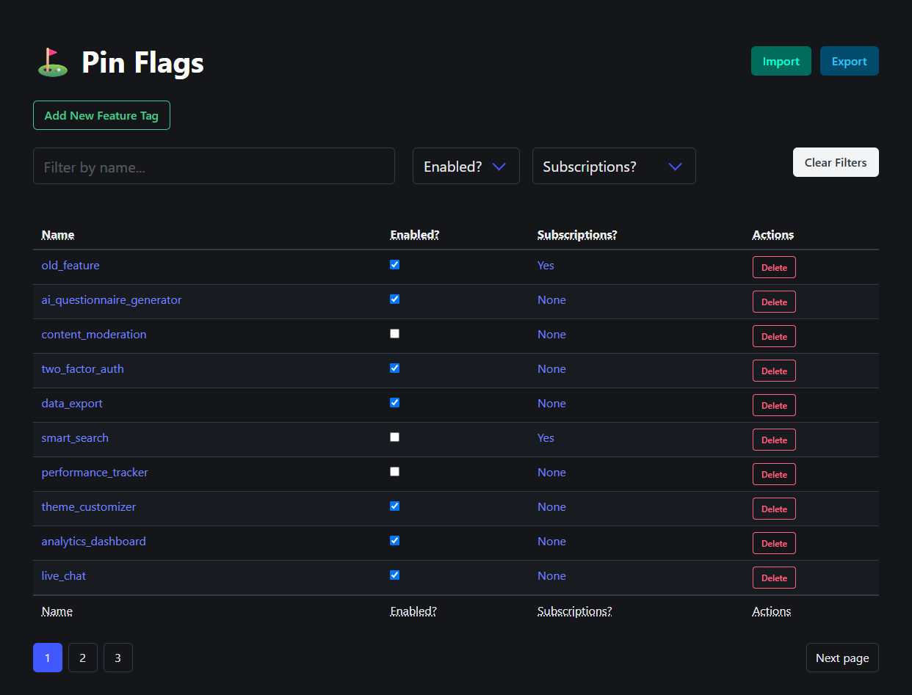
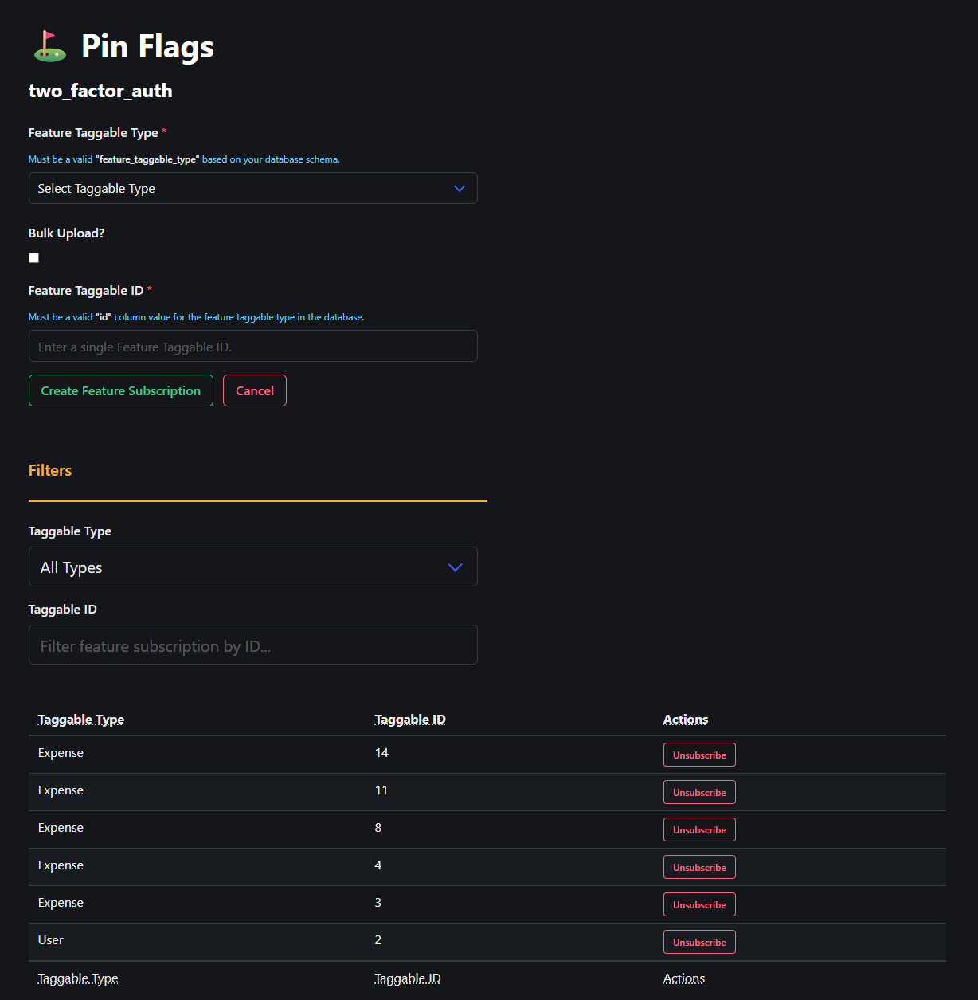

# ⛳ Pin Flags

A lightweight Rails engine for managing entity based features with built-in caching support. "Pin features" to any ActiveRecord model with ease, providing a slightly different take on traditional feature flags.

<div style="display: flex; justify-content: center;">
  
</div>

## Features

- 🚀 Polymorphic "feature tags" which can be tied to any ActiveRecord Model 
- ⚡ Built-in caching with configurable expiry
- 🎨 An admn UI that stays out of your way with minified [BulmaCSS](https://github.com/jgthms/bulma) and [AlpineJS](https://github.com/alpinejs/alpine)
- 🔒 Isolated namespace to avoid conflicts
- 💉 No dependency on Stimulus 

<div style="display: flex; justify-content: center;">
  
</div>

## Dependencies
- [Rails](https://github.com/rails/rails) 7.0 or higher with Turbo
- [Ruby](https://www.ruby-lang.org/en/) 3.0 or higher
- Rails app is using a relational database (e.g., PostgreSQL, MySQL, SQLite)

## Installation

Add this line to your application's Gemfile:

```ruby
gem "pin_flags"
```

And then execute:

```bash
$ rails g pin_flags:install
```

Run the migration to create the necessary database tables:

```bash
$ rails db:migrate
```

### Basic Configuration

Configure PinFlags in an initializer (e.g., `config/initializers/pin_flags.rb`):

```ruby
PinFlags.config do |config|
  config.cache_prefix = "my_app_flags"  # Default: "pin_flags"
  config.cache_expiry = 1.hour          # Default: 12.hours
end
```

### HTTP Basic Authentication

PinFlags includes built-in HTTP Basic Authentication to protect the admin interface. Configure it in your initializer:

```ruby
PinFlags.config do |config|
  config.cache_prefix = "budget_tracker_pin_flags"
  config.cache_expiry = 1.hour
  config.http_basic_auth_enabled = true    # Default: true
  config.http_basic_auth_user = "admin"    # Default: "pin_flags_admin"  
  config.http_basic_auth_password = "password"  # Default: "please_change_me"
end
```

**Security Note:** Always change the default credentials in production environments.

### Consider using environment variables for sensitive information:

```ruby
PinFlags.config do |config|
  config.http_basic_auth_user = ENV["PIN_FLAGS_USER"] || "pin_flags_admin"
  config.http_basic_auth_password = ENV["PIN_FLAGS_PASSWORD"] || "please_change_me"
end
```

### Or use Rails credentials:

```ruby
PinFlags.config do |config|
  config.http_basic_auth_user = Rails.application.credentials.pin_flags[:user] || "pin_flags_admin"
  config.http_basic_auth_password = Rails.application.credentials.pin_flags[:password] || "please_change_me"
end
```

To disable authentication entirely:

```ruby
PinFlags.config do |config|
  config.http_basic_auth_enabled = false
end
```

## Usage

### Include the module in any of your ActiveRecord models:

```ruby
class SomeModel < ApplicationRecord
  include PinFlags::FeatureTaggable
end
```

### What this does:

Including `PinFlags::FeatureTaggable` in your model adds the following capabilities:

- **Polymorphic associations**: Your model gets `feature_subscriptions` and `feature_tags` associations
- **Feature flag checking**: Methods to check if specific features are enabled/disabled for instances
- **Pin/Unpin operations**: Ability to add or remove feature tags from individual records
- **Cached lookups**: Feature flag status is cached for performance

### Example Usage

```ruby
# Include the module in your models
class User < ApplicationRecord
  include PinFlags::FeatureTaggable
end

class Organization < ApplicationRecord
  include PinFlags::FeatureTaggable
end

# Create some feature tags
PinFlags::FeatureTag.create!(name: "premium_features", enabled: true)
PinFlags::FeatureTag.create!(name: "beta_features", enabled: true)
PinFlags::FeatureTag.create!(name: "deprecated_ui", enabled: false)

# Working with individual records
user = User.find(1)

# Pin a feature to a user (creates the tag if it doesn't exist)
user.feature_tag_pin("premium_features")

# Check if user has a specific feature tag
user.feature_tag?("premium_features")           # => true
user.feature_tag?("nonexistent_feature")       # => false

# Check if a feature is enabled for the user
user.feature_tag_enabled?("premium_features")  # => true
user.feature_tag_enabled?("deprecated_ui")     # => false (tag exists but disabled)

# Check if a feature is disabled for the user
user.feature_tag_disabled?("deprecated_ui")    # => true

# Remove a feature tag from a user
user.feature_tag_unpin("premium_features")

# Access all feature tags for a user
user.feature_tags                               # => ActiveRecord collection
user.feature_tags.enabled                      # => Only enabled tags
user.feature_tags.disabled                     # => Only disabled tags

# Bulk operations using the model directly
PinFlags::FeatureSubscription.create_in_bulk(
  feature_tag: PinFlags::FeatureTag.find_by(name: "beta_features"),
  feature_taggable_type: "User",
  feature_taggable_ids: User.where(some_boolean_attribute: true).pluck(:id)
)

# Global feature flag management
PinFlags::FeatureTag.enable("new_dashboard")   # Enable globally
PinFlags::FeatureTag.enabled?("new_dashboard") # Check if globally enabled
PinFlags::FeatureTag.disable("old_feature")   # Disable globally
PinFlags::FeatureTag.disabled?("old_feature") # Check if globally disabled

# Check if a feature is enabled for a specific subscriber
PinFlags::FeatureTag.enabled_for_subscriber?("premium_features", user)
```

### Available Methods

**Instance methods added to your model:**
- `feature_tag_pin(tag_name)` - Pin a feature tag to this record
- `feature_tag_unpin(tag_name)` - Remove a feature tag from this record  
- `feature_tag?(tag_name)` - Check if this record has a feature tag
- `feature_tag_enabled?(tag_name)` - Check if feature is enabled for this record
- `feature_tag_disabled?(tag_name)` - Check if feature is disabled for this record
- `feature_tags` - Get all feature tags for this record
- `feature_subscriptions` - Get all feature subscriptions for this record

**Class methods for feature management:**
- `PinFlags::FeatureTag.enable(tag_name)` - Enable a feature globally
- `PinFlags::FeatureTag.disable(tag_name)` - Disable a feature globally
- `PinFlags::FeatureTag.enabled_for_subscriber?(tag_name, record)` - Check if enabled for specific record


### Mounting the Engine

Add PinFlags to your routes:

```ruby
# config/routes.rb
Rails.application.routes.draw do
  mount PinFlags::Engine, at: "/pin_flags"
  # your other routes...
end
```

### Configuration Options

| Option | Description | Default |
|--------|-------------|---------|
| `cache_prefix` | Prefix for cache keys | `"pin_flags"` |
| `cache_expiry` | Cache expiration time | `12.hours` |
| `http_basic_auth_enabled` | Enable HTTP Basic Authentication | `true` |
| `http_basic_auth_user` | Username for admin interface | `"pin_flags_admin"` |
| `http_basic_auth_password` | Password for admin interface | `"secure_password"` |

## Development

> Please prefer to test against an actual Rails application rather than using the built-in test/dummy app.

- `git clone` the PinFlags repository locally on your machine:

- Add the gem to your Rails application's Gemfile:

```ruby
gem "pin_flags", path: "path/to/pin_flags"
```
- Mount the engine in your application's routes:

```ruby
# config/routes.rb
Rails.application.routes.draw do
  mount PinFlags::Engine, at: "/pin_flags"
  # your other routes...
end
```

- Run the generator to install the engine:

```bash
$ rails g pin_flags:install
``` 
- Run the migrations to create the necessary database tables:

```bash
$ rails db:migrate
``` 
- Start your Rails server

### Running Tests

- Navigate to the root of the PinFlags gem directory where you cloned the repository.

```bash
$ rails test
```

## Contributing

1. Fork the repository
2. Create your feature branch (`git checkout -b feature/amazing-feature`)
3. Commit your changes (`git commit -am 'Add some amazing feature'`)
4. Push to the branch (`git push origin feature/amazing-feature`)
5. Open a Pull Request

Please make sure to:
- Add tests for new features
- Update documentation as needed
- Follow the existing code style
- Write clear commit messages

## Versioning

This project uses [Semantic Versioning](https://semver.org/). For available versions, see the [tags on this repository](https://github.com/yourusername/pin_flags/tags).

## License

The gem is available as open source under the terms of the [MIT License](https://opensource.org/licenses/MIT).

## Support

If you encounter any issues or have questions:

1. Check the [Issues](https://github.com/yourusername/pin_flags/issues) page
2. Create a new issue if your problem isn't already reported
3. Provide as much detail as possible including:
   - Rails version
   - Ruby version
   - Steps to reproduce
   - Expected vs actual behavior
